# AgentBox 使用指南

这份指南带你从空白部署走到第一个可操作的 Agent 沙箱。最短路径只有六步：启动 AgentBox、登录、连接 Linux Worker、添加模型服务、创建沙箱模板、创建沙箱。

文中的截图来自当前 `main` 分支的真实页面。截图数据仅用于演示，项目名、服务器名、资源名和镜像指纹已替换为演示值，所有密钥、配对 Token 和内网代理地址都已排除。

## 开始前准备

你需要：

- 一台运行 AgentBox 控制面的机器，已安装 Docker Engine 和 Docker Compose v2；
- 至少一台可由控制面访问的 Linux 物理机或 VM，用来运行 Worker 和沙箱；
- 至少一个受支持模型服务的 API Key；
- 浏览器能够访问 AgentBox，Linux Worker 也能够访问同一个 AgentBox 入口地址。

AgentBox 控制面和 Worker 可以装在同一台 Linux 机器上，也可以分开部署。生产环境建议使用 HTTPS 反向代理，不要直接把数据库或 Go API 端口暴露到公网。

## 1. 部署并登录

在控制面机器上执行：

```sh
git clone https://github.com/7-e1even/AgentBox.git
cd AgentBox
docker compose up -d
docker compose ps
```

本机或可信内网体验可以直接启动。长期运行或公开部署时，先把 `.env.example` 复制为 `.env`，至少修改 `POSTGRES_PASSWORD`；位于 Nginx、Caddy 等反向代理之后时，还要设置公开地址、允许来源和 `AGENTBOX_TRUSTED_PROXY=true`。终端、桌面和模型流还要求代理正确处理 WebSocket 与 SSE，参见[《传输与反向代理兼容矩阵》](transport-compatibility.md)。

浏览器打开 `http://<控制面地址>:3000`。全新数据库会引导第一个用户创建管理员账号；之后使用用户名和密码登录，邮箱不是登录名。

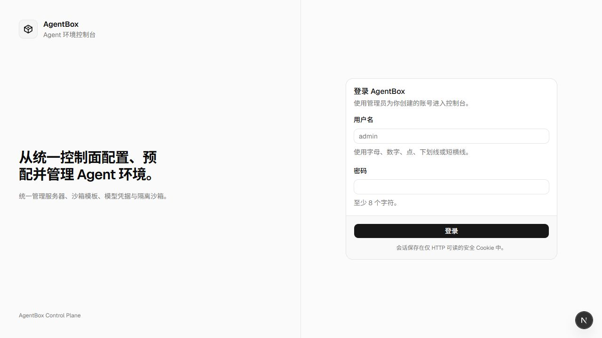

登录后先看“概览”。四项准备度中，服务器、模板和模型凭据是创建沙箱的核心条件；Docker 镜像可以在第一次创建时拉取。

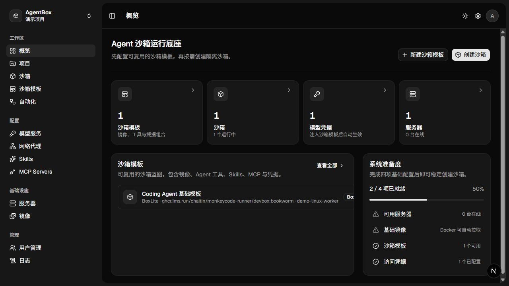

完成标志：浏览器能打开控制台，页面右上角能看到当前账号，概览不再显示加载错误。

## 2. 连接 Linux Worker

进入“基础设施 → 服务器”，点击“添加服务器”。

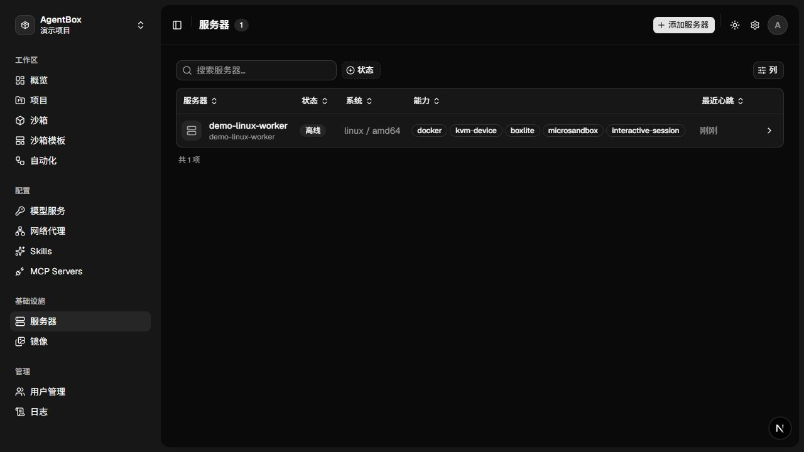

在“平台入口地址”中填写 Linux 服务器实际能够访问的 AgentBox Web 地址，例如 `https://agentbox.example.com` 或可信内网中的 `http://192.168.1.10:3000`。不要填写只在控制面本机有效的 `127.0.0.1`。

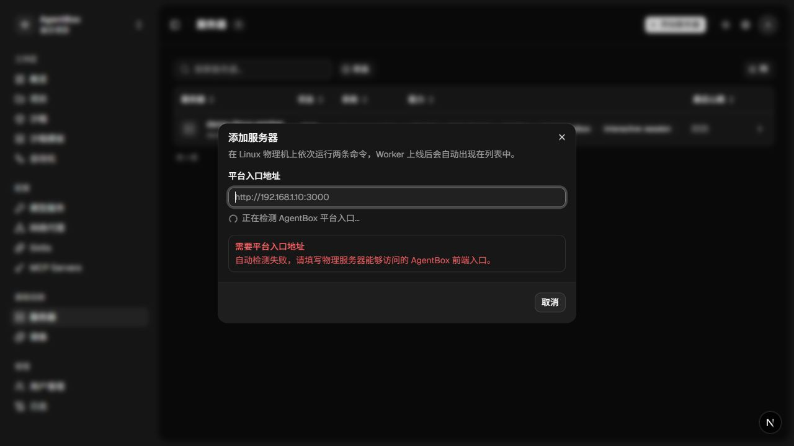

地址确认后，页面会生成两条命令：

1. 安装 `agentbox-worker`；
2. 使用一次性 Token 把 Worker 配对到当前控制面。

依次在目标 Linux 服务器上执行这两条命令。配对 Token 有过期时间，也相当于临时凭据，不要粘贴到 Issue、聊天记录或公开文档中。Worker 上线后，弹窗会自动结束，服务器列表会显示系统架构、能力和最近心跳。

完成标志：服务器状态为“在线”，并显示 `docker`、`boxlite`、`microsandbox`、`interactive-session` 等实际探测到的能力。没有显示的隔离类型不要强行选用。

如果服务器一直离线，在目标机检查：

```sh
sudo systemctl status agentbox-worker
sudo journalctl -u agentbox-worker -n 100 --no-pager
sudo systemctl restart agentbox-worker
```

重启后等待新的心跳。服务进程显示 `active` 不等于心跳一定成功，还要回到 Web 页面确认状态变为在线。

## 3. 添加模型服务

进入“配置 → 模型服务”，点击“添加服务”。一个模型服务保存一组协议、API 地址、API Key 和可用模型目录。

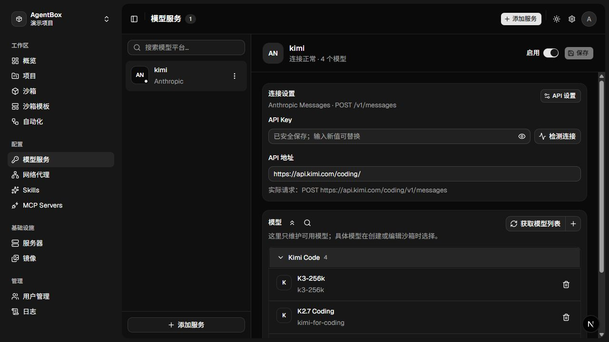

填写以下字段：

- “服务名称”：便于团队识别，例如 `OpenAI Production` 或 `Kimi Code`；
- “API Key”：只在模型服务页面录入，不要放进普通环境变量；
- “API 类型”：按供应商实际兼容协议选择，不要只根据模型名称猜测；
- “API 地址”：填写 API 根地址，页面下方会显示最终请求路径。

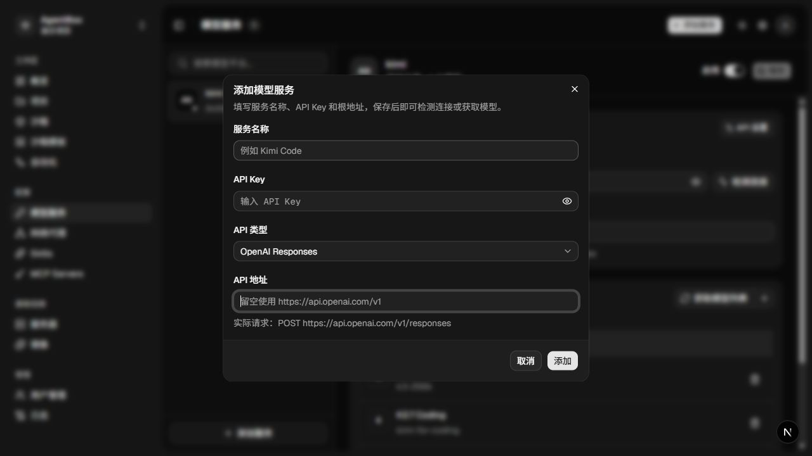

保存后点击“检测连接”。连接正常后，可以点击“获取模型列表”，也可以手工添加供应商实际支持的模型 ID。模型服务这里只维护可用目录，具体使用哪个模型要在创建沙箱时再选择。

完成标志：服务显示“连接正常”，至少有一个可选模型。

## 4. 准备 Skills 和 MCP Servers（可选）

如果只想先启动一个 CLI Agent，可以跳到下一节。需要让新沙箱自动带上工作方法或外部工具时，再配置 Skills 和 MCP Servers。

### Skills

进入“配置 → Skills”，点击“添加 Skill”添加项目需要的能力。AgentBox 不预置 Skill，只有主动创建并绑定到沙箱模板的 Skill 才会安装到沙箱。

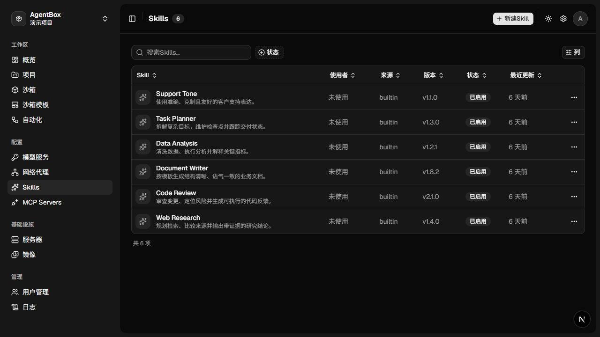

点击“添加 Skill”，默认进入 skills.sh 搜索，也可以选择“链接导入”“本地上传”或“手动编写”：

- 搜索输入 2–100 个字符的关键词，按回车或点击“搜索”。展示 skills.sh 返回的 GitHub 来源、名称和安装量，每次最多 20 条；当前项目已导入的来源会标记“已导入”。点击“选择”读取正文和附件，再进入确认页面；“返回结果”会保留本次搜索。其他来源类型暂不展示，搜索故障会明确提示重试，不会显示成空目录。

- 链接导入支持 skills.sh 的 GitHub 来源详情链接，例如 `https://skills.sh/vercel-labs/skills/find-skills`。点击“浏览 skills.sh”选择 Skill，再复制详情链接；AgentBox 会按名称定位公开仓库中的 Skill 目录，保留全部附件，无需执行安装命令或配置目录 API 凭据。仓库归档下载上限为 32 MiB，选定 Skill 仍受下述文件数量和大小限制。非 GitHub 来源请使用文件直链或本地上传。
- 也支持公开的 HTTPS `SKILL.md` 直链、GitHub 文件页面（`/blob/.../SKILL.md`）及 ZIP 直链；单文件链接只导入该文件。需要完整目录时，请使用 skills.sh 链接或 ZIP。不支持内网地址、私有仓库认证或自动同步。
- 本地上传支持 `.md` 和包含单个 Skill 的 ZIP。`SKILL.md` 需包含 YAML 元数据 `name`、`description` 和指令正文；ZIP 内可保留 `scripts/`、`references/`、`assets/` 等附件。上传文件与解压后的总大小各不超过 4 MiB，最多 128 个文件，单文件不超过 1 MiB；拒绝符号链接、重复路径和目录穿越。
- 手动编写保留名称、唯一标识、版本和指令编辑能力。

链接和本地文件先点击“读取并预览”。确认页面可以检查名称、唯一标识、所属项目、完整 `SKILL.md` 和附带文件；版本、分类和来源记录收在“高级配置”中。最后点击“确认导入”。读取不会保存或执行内容；已有标识不会被覆盖。导入后保存的是当前内容，Worker 不再依赖原链接，而是将正文和附件一并安装到沙箱中。请只导入信任的内容，脚本在后续由 Agent 使用时可能执行。

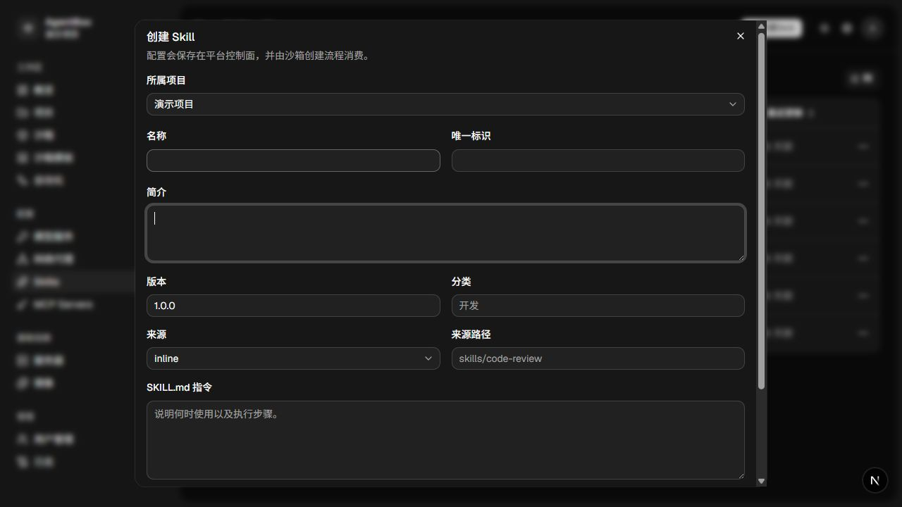

### MCP Servers

进入“配置 → MCP Servers”。AgentBox 支持把 STDIO 命令或 HTTP 服务声明注入新沙箱。

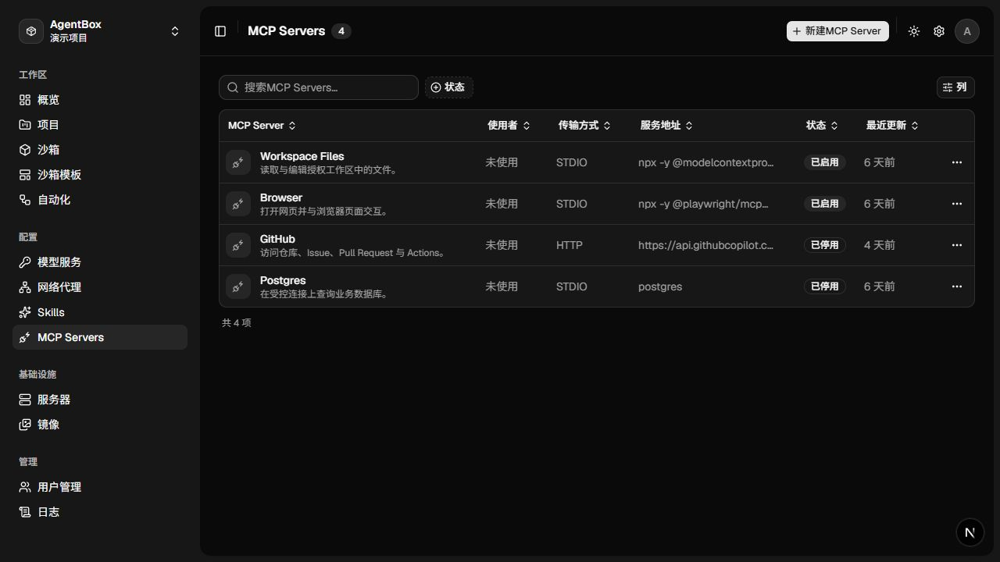

新建时选择 Transport：

- STDIO：填写启动命令和参数，例如通过 `npx` 启动 MCP Server；
- HTTP：填写服务 URL；需要 Header 时使用密钥引用，不要把 Token 写进名称、简介或普通变量。

DeepSeek Harness 使用随 DSH 固定版本安装的官方 MCP Client：STDIO 会映射为 `stdio`，HTTP 会映射为 `streamable-http`，并在 Agent 首轮交互前加载。DSH `0.1.0-rc.7` 的原生 MCP Client 不提供逐工具审批；在模板中选中某个 MCP Server，等同于信任它暴露的工具及其副作用。

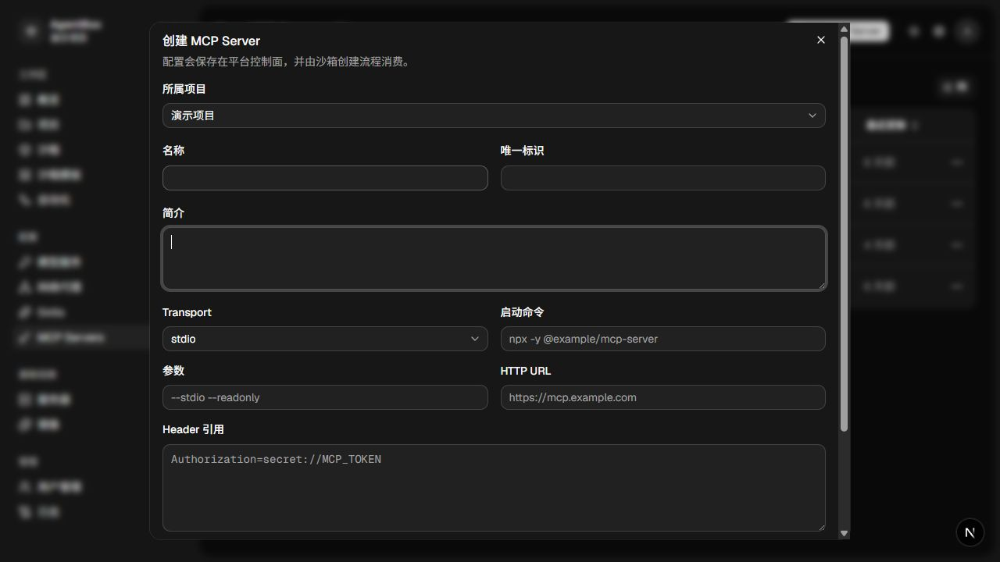

完成标志：所需 Skill 或 MCP Server 状态为“已启用”。只有在模板或沙箱中选中它们，创建时才会真正注入。

## 5. 创建沙箱模板

模板把服务器、隔离类型、系统镜像、Agent 工具和模型服务保存成可复用组合。进入“工作区 → 沙箱模板”，点击“新建沙箱模板”。

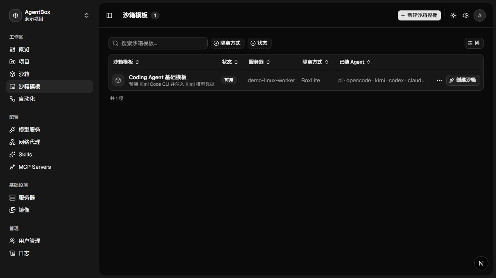

先完成基础配置：

1. 填写名称、唯一标识和用途说明；
2. 选择在线服务器；
3. 选择服务器真实支持的隔离类型；
4. 选择或输入系统镜像；
5. 只勾选实际要安装的 Agent 工具；
6. 勾选沙箱允许使用的模型服务。

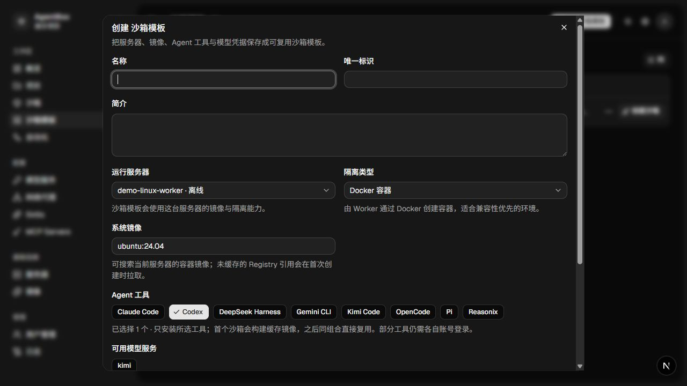

三种隔离类型的选择原则：

- Docker：兼容性最好，使用普通 OCI 容器；
- BoxLite：使用独立 MicroVM，适合需要更强隔离的 Agent；
- Microsandbox：只在服务器能力检测为可用时选择。

打开“高级配置”可以设置工作目录、初始化命令、CPU、内存、网络策略、代理、Skills、MCP Servers 和普通环境变量。

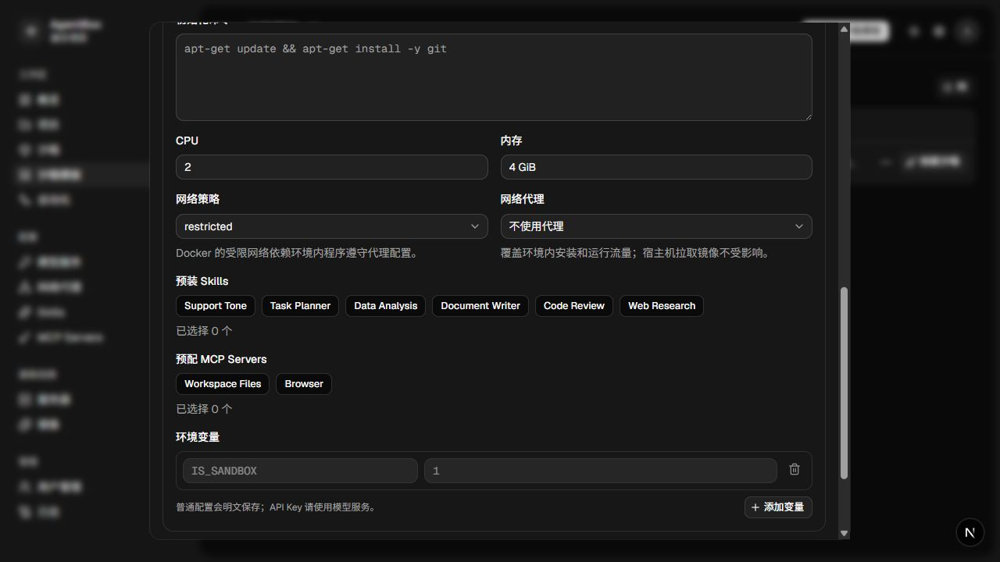

这里的普通环境变量会明文保存，适合 `NODE_ENV`、功能开关等非敏感配置。API Key 应继续放在“模型服务”中。受限网络只控制沙箱内安装和运行流量；宿主机拉取镜像不使用这里的代理。

首个沙箱可能需要拉取镜像并构建所选 Agent 工具的缓存，耗时会比之后创建相同组合更长。

完成标志：模板状态为“可用”，列表能看到正确的服务器、隔离方式和 Agent 工具。

## 6. 创建沙箱

进入“工作区 → 沙箱”，点击“创建沙箱”。

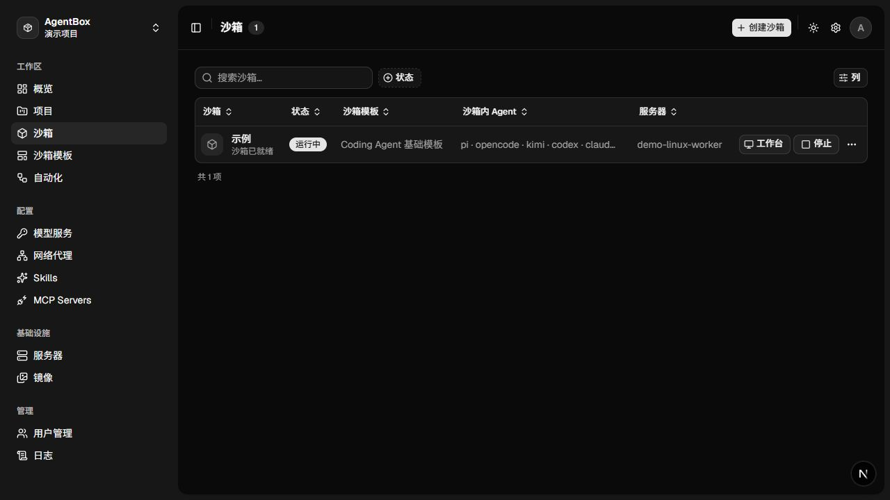

创建向导会继承模板配置。依次确认：

1. 名称和唯一标识；
2. 模板、在线服务器、隔离类型和镜像；
3. CPU、内存、网络、工作目录和初始化命令；
4. 本次沙箱实际需要的 Agent 工具；
5. Skills、MCP Servers 和环境变量；
6. 每个已选模型服务对应的具体模型。

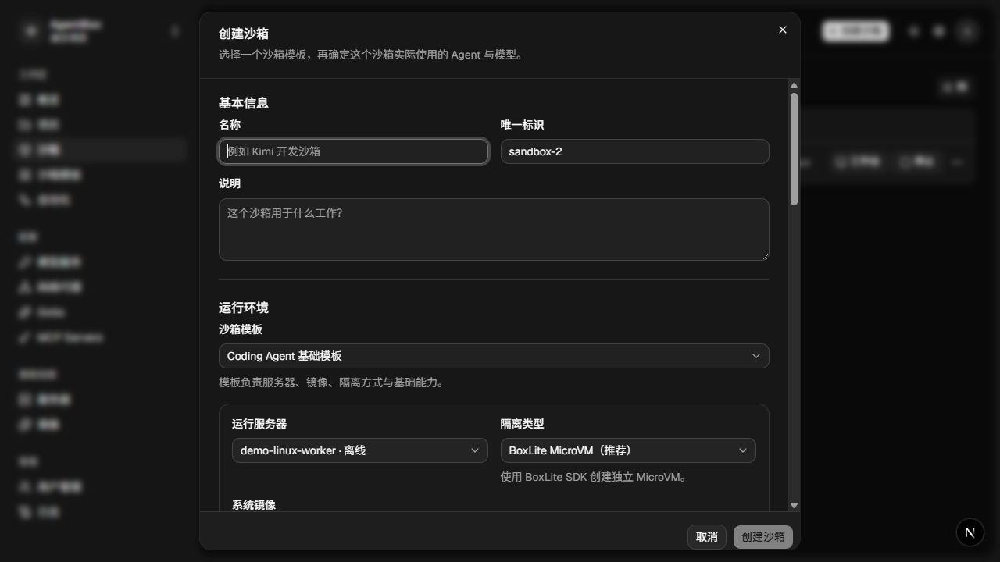

模板提供默认组合，但你可以为单个沙箱增减能力。修改只影响当前沙箱，不会反向改写模板。

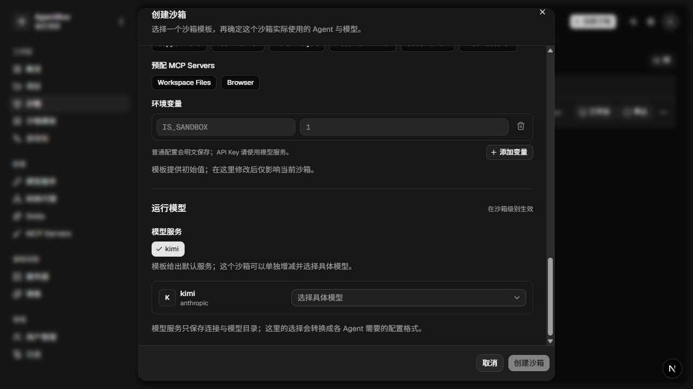

“创建沙箱”按钮不可用时，优先检查页面中的红色提示。最常见原因是服务器离线、模板已停用，或者已选模型服务还没有指定具体模型。

创建后会先显示处理中状态。等状态变成“运行中”再打开工作台；首次拉取镜像或构建 Agent 缓存时，请结合服务器和日志页面判断进度，不要反复提交同一个沙箱。

完成标志：沙箱状态为“运行中”，列表出现“工作台”入口。

## 7. 使用沙箱工作台

点击沙箱行末的“工作台”。工作台由三部分组成：左侧资源管理器、中间编辑区域和终端；顶部按钮可以隐藏或显示各面板。

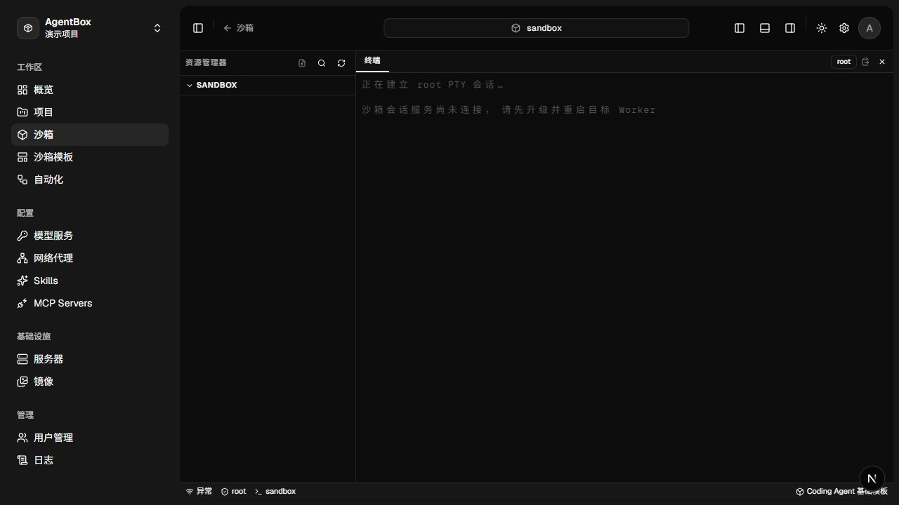

常用操作：

- 在资源管理器中浏览、上传和刷新文件；
- 在终端中运行已安装的 `codex`、`claude`、`kimi`、`pi` 等工具；
- 通过顶部按钮调整资源管理器、终端和检查器的显示；
- 需要变更模板注入的 Skills、MCP 或环境变量时，编辑配置后按页面提示重启沙箱。

截图中的“沙箱会话服务尚未连接”是故障状态示例。遇到它时先确认服务器在线，再升级并重启目标 Worker；单纯刷新浏览器不能修复缺少会话能力的旧 Worker。

## 8. 查看镜像库存

进入“基础设施 → 镜像”，先选择服务器，再切换“容器镜像”或“VM 磁盘”。

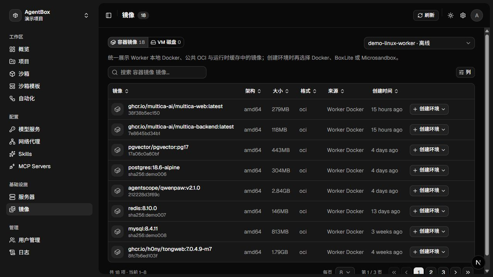

“Worker Docker”表示宿主机 Docker 已有的镜像；运行时缓存属于 BoxLite 或 Microsandbox 自己的库存，两者不能简单视为同一份缓存。Docker 引用通常可以在首次创建时拉取；原生 VM 磁盘不会因为填写了一个名称就自动生成。

## 9. 使用 Webhook 自动化（可选）

进入“工作区 → 自动化”。自动化把外部 Webhook 事件转换为可追踪的 Run，再复用现有模板和 Worker 链路创建、执行或销毁沙箱。

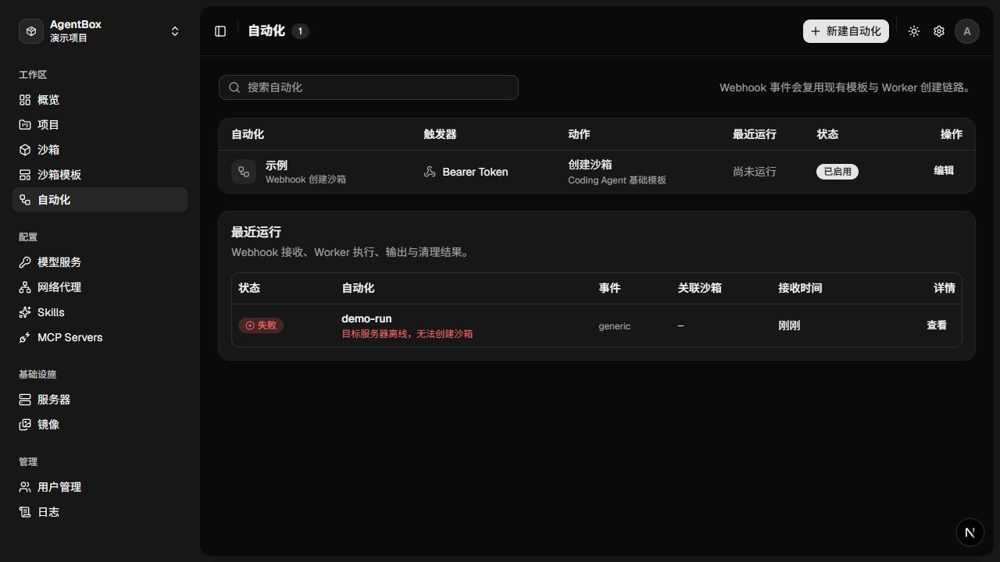

新建自动化时选择鉴权方式、动作类型、目标模板和具体模型。简单规则直接在表单中完成；条件表达式和 Spec 覆盖放在“高级条件与 Spec”中。

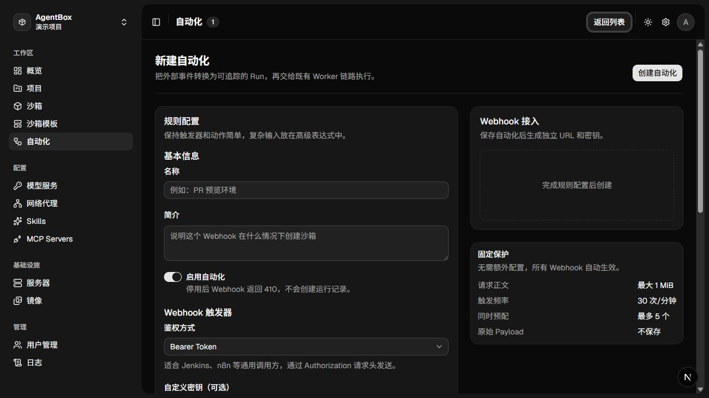

保存后才会生成独立 Webhook URL 和密钥。密钥只交给调用方，不能提交到仓库。GitHub、GitLab、Jenkins、n8n 的请求示例、幂等规则、状态轮询和 HMAC 签名见[《Webhook 流水线接入指南》](webhook-automation.md)。

AgentBox 自动化提供可靠的隔离任务原语，不替代 CI/CD 中的条件分支、并行矩阵或跨步骤 DAG。

## 10. 用日志定位问题

管理员可以进入“管理 → 日志”，按关键词、分类、级别和结果筛选 API 访问、配置变更与运行事件。

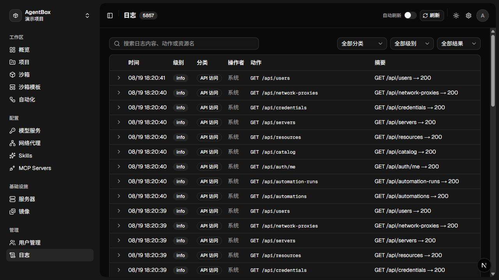

排查顺序建议固定为：

1. 页面提示和沙箱状态；
2. “服务器”页面的在线状态与最近心跳；
3. “自动化”页面的 Run 详情；
4. “日志”页面中对应时间的错误；
5. 目标机上的 `journalctl -u agentbox-worker`；
6. 控制面容器日志。

控制面日志命令：

```sh
docker compose logs -f app server postgres
```

## 11. 项目、用户和权限

项目用来隔离模板、沙箱、Skills、MCP 和变量引用。通过左上角项目切换器确认当前项目，再创建资源，避免把配置放进错误项目。

管理员可以在“用户管理”中创建账号并分配角色：

- `admin`：管理服务器、凭据、用户和平台配置；
- `operator`：管理项目内沙箱、模板、自动化和镜像等运行资源；
- `viewer`：只读查看。

生产环境不要共享管理员账号。为日常使用创建最小权限账号，并在“日志”中审计高风险变更。

## 12. 更新、备份和停止

更新控制面：

```sh
docker compose pull
docker compose up -d
```

控制面升级后，可以在服务器详情页检查 Worker 版本并执行在线更新。旧版本 Worker 如果还没有自更新能力，需要在物理服务器上重新运行一次安装命令；安装器会保留已有配对配置。

停止服务：

```sh
docker compose down
```

普通更新不要执行 `docker compose down -v`，否则会删除命名卷。完整备份必须同时保存 PostgreSQL 数据和 `agentbox-secrets` 卷中的凭据加密主密钥；具体命令见根目录 [README](../README.md#备份与恢复)。主密钥丢失后，数据库中的模型凭据无法解密。

## 常见问题速查

| 现象                 | 先检查什么                               | 处理方向                                                  |
| -------------------- | ---------------------------------------- | --------------------------------------------------------- |
| 页面打不开           | `docker compose ps`、3000 端口、反向代理 | 先确认 `app`、`server`、`postgres` 都健康                 |
| Worker 一直离线      | 服务器地址、系统服务、最近心跳           | 重启 Worker，并同时查看 Web 状态和 `journalctl`           |
| 创建按钮不可用       | 页面红色提示                             | 恢复在线服务器、启用模板、为每个服务选择模型              |
| 首次创建很慢         | 镜像拉取和 Agent 缓存构建                | 查看 Worker/控制面日志，等待当前任务完成                  |
| Agent 报 401         | 模型服务检测、Worker 版本、运行时缓存    | 先确认当前 Worker 和 Agent 工具版本，不要只重复更换 Token |
| 工作台无法连接       | `interactive-session` 能力和 Worker 版本 | 升级并重启 Worker，再重新打开工作台                       |
| 受限网络无法安装依赖 | 沙箱代理和宿主机镜像拉取链路             | 分开验证沙箱内代理与宿主机 Registry 访问                  |

最短验收结果应该是：服务器在线、模型服务连接正常、模板可用、沙箱运行中、工作台终端能够执行命令。只看到配置出现在页面上，还不能证明 Worker、运行时和模型提供方的整条链路已经可用。
